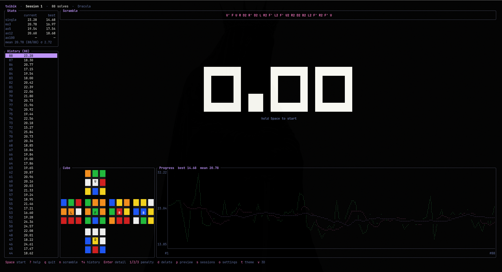
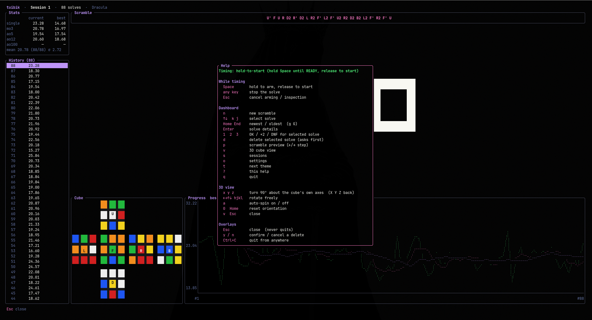
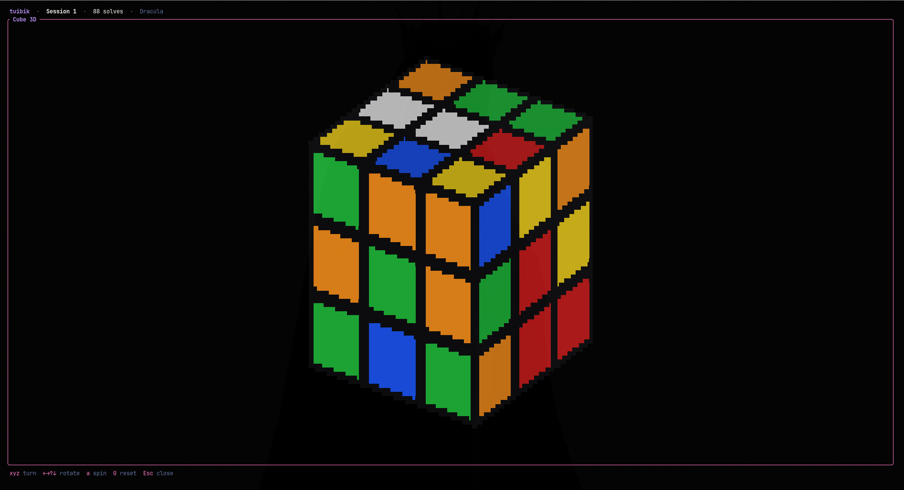

# tuibik

[](https://github.com/Bubbl33s/tuibik/actions/workflows/ci.yml)

A csTimer-style **Rubik's Cube 3×3 timer for your terminal**, written in Rust
with [ratatui](https://ratatui.rs) + [crossterm](https://github.com/crossterm-rs/crossterm).



- **WCA random-state scrambles** via the Kociemba two-phase solver
  ([`min2phase`](https://crates.io/crates/min2phase)); the scramble
  always wraps so every move is readable.
- **Big, centered timer** with a text state label (`HOLD` / `READY` /
  `INSPECT` / `SOLVING`). While you arm, inspect or solve, every panel gets out
  of the way (**focus mode**); the dashboard returns when the solve stops.
- **Post-solve feedback**: the delta against your previous solve, the updated
  ao5 / ao12, and a notice when you set a new personal best (single, ao5, ao12).
- **Penalties**: `+2` and `DNF` per solve, honoured by every statistic using the
  WCA rules (a DNF is the slowest result; too many DNFs make an average DNF).
- **Optional WCA inspection**: 15 s countdown with 8 s / 12 s cues, an
  automatic `+2` when you start between 15 s and 17 s, and a DNF at 17 s.
- **Responsive dashboard**: header (session, solve count, theme), a
  current/best statistics table and a scrolling history on the left, and the
  cube net and a progress chart (times + ao5 + ao12) below the timer. It adapts
  to wide, medium and compact terminals, with a "terminal too small" screen
  below 40×12.
- **Solve details**: date, scramble, raw and effective time, and the ao5 / ao12
  at that solve; delete asks for confirmation.
- **Persistent history & statistics** in SQLite: mean (with counted/total),
  best, worst, standard deviation, mo3, Ao5 / Ao12 / Ao100 (WCA trimming) and
  the best historical values. Databases from older versions upgrade
  automatically.
- **Multiple sessions**: create, rename, switch, and delete; the active session
  is remembered between runs.
- **Step-by-step scramble preview**: walk the scramble move by move.
- **Settings overlay**: inspection, show/hide the running time, and theme; all
  persisted.
- **Color themes**: several modern palettes, changed live and persisted.





## Install

### Download a release

Download the archive for your system from [GitHub Releases](https://github.com/Bubbl33s/tuibik/releases/latest), then unpack it. Release assets follow this naming scheme:

| Platform | Archive |
| --- | --- |
| Linux x86_64 | `tuibik-<version>-x86_64-unknown-linux-gnu.tar.gz` |
| macOS Intel | `tuibik-<version>-x86_64-apple-darwin.tar.gz` |
| macOS Apple Silicon | `tuibik-<version>-aarch64-apple-darwin.tar.gz` |
| Windows x86_64 | `tuibik-<version>-x86_64-pc-windows-msvc.zip` |

For example, on Linux, replace `<version>` with the release version (without
the leading `v`):

```bash
curl -LO https://github.com/Bubbl33s/tuibik/releases/download/v<version>/tuibik-<version>-x86_64-unknown-linux-gnu.tar.gz
curl -LO https://github.com/Bubbl33s/tuibik/releases/download/v<version>/SHA256SUMS
sha256sum -c SHA256SUMS --ignore-missing
tar -xzf tuibik-<version>-x86_64-unknown-linux-gnu.tar.gz
install -Dm755 tuibik-<version>-x86_64-unknown-linux-gnu/tuibik ~/.local/bin/tuibik
```

Ensure `~/.local/bin` is on your `PATH`, then start it with `tuibik`. On macOS,
verify an archive with `shasum -a 256 <archive>` and compare it with
`SHA256SUMS`; on Windows, use `Get-FileHash <archive> -Algorithm SHA256`.

### Build from source

tuibik requires Rust 1.88 or newer. To build from a clone:

```bash
cargo build --release --locked --bin tuibik
./target/release/tuibik
```

Or install directly from the repository:

```bash
cargo install --git https://github.com/Bubbl33s/tuibik --locked --bin tuibik
```

## Compatibility

Release archives are built for Linux x86_64, macOS x86_64, macOS Apple Silicon,
and Windows x86_64. The app needs a terminal at least **40 columns by 12 rows**;
below that it displays a too-small-terminal message instead of the dashboard.

tuibik uses the Kitty keyboard protocol, when supported by the terminal, to
detect `Space` key release for hold-to-start timing. Terminals without that
protocol automatically use tap-to-start: press `Space` once to start and any
key to stop. This fallback is intentional and cannot get stuck in the armed
state. If a supported release does not work in your terminal, please [open a
bug report](https://github.com/Bubbl33s/tuibik/issues/new?template=bug_report.yml)
with your OS, architecture, terminal emulator, terminal size, and `tuibik
--version` output.

## Your data and backups

tuibik stores sessions, solves, and settings in a SQLite file named
`tuibik.sqlite`. Its platform data directory is normally:

| Platform | Data file |
| --- | --- |
| Linux | `$XDG_DATA_HOME/tuibik/tuibik.sqlite`, or `~/.local/share/tuibik/tuibik.sqlite` when `XDG_DATA_HOME` is unset |
| macOS | `~/Library/Application Support/tuibik/tuibik.sqlite` |
| Windows | `%LOCALAPPDATA%\\tuibik\\data\\tuibik.sqlite` |

To back up, quit tuibik first and copy `tuibik.sqlite` to a safe location. Do
not rely on copying a database while the app is running. To restore, quit
tuibik, replace that file with the backup, then start the app; any applicable
migrations run when it opens.

## Build & run

For development, use a Rust 1.88+ toolchain.

```bash
cargo run --release
```

## Controls

Press `?` in the app for the same list.

**While timing**

| Key         | Action                                                    |
|-------------|-----------------------------------------------------------|
| `Space`     | Hold to arm, release to start (tap to start in tap mode)  |
| any key     | Stop the solve                                            |
| `Esc`       | Cancel arming / inspection (records nothing)              |

**Dashboard**

| Key                 | Action                                              |
|---------------------|-----------------------------------------------------|
| `n`                 | New scramble                                        |
| `↑` / `↓` (`k`/`j`) | Select a solve in the history                       |
| `Home` / `End` (`g`/`G`) | Jump to the newest / oldest solve              |
| `Enter`             | Solve details                                       |
| `1` / `2` / `3`     | Set the selected solve to OK / +2 / DNF             |
| `d`                 | Delete the selected solve (asks first: `y` / `n`)   |
| `p`                 | Scramble preview (`←`/`→` or `h`/`l` to step)       |
| `s`                 | Sessions (`n` new, `r` rename, `d` delete, `Enter` switch) |
| `o`                 | Settings                                            |
| `t`                 | Next theme                                          |
| `?`                 | Help                                                |
| `q`                 | Quit                                                |

**Everywhere**

| Key      | Action                                                      |
|----------|-------------------------------------------------------------|
| `Esc`    | Close the open overlay. It never quits the app.             |
| `Ctrl+C` | Quit from any state                                         |

> **Changed:** `Esc` no longer quits (it cancels/closes) and `Enter` no longer
> starts the timer (it opens the selected solve); `q` quits only from the idle
> dashboard, and `Space` is the only start key.

### Timing modes

The hold-to-start behavior uses the Kitty keyboard protocol to receive
key-release events. When the terminal doesn't support it, tuibik switches to
**tap-to-start**: press `Space` to start, press any key to stop, and a
notification says so at startup. (Without release events a held key can't be
told apart from repeated presses, so hold-to-start is impossible; tap mode can
never get stuck.) The help overlay shows which mode is active.

### Inspection

With WCA inspection on (`o` → *WCA inspection*), the first `Space` starts a
15-second countdown. Start the solve the normal way (hold and release, or a tap
in tap mode). Starting after 15 s gives a `+2`; if 17 s pass, the attempt is
recorded as a DNF. `Esc` cancels inspection without recording anything.

## Workspace layout

- `cube` — cube model (cubie-level), WCA move notation, and net rendering data.
- `scramble` — WCA random-state scramble generation (wraps `min2phase`).
- `stats` — speedcubing statistics (means, deviations, WCA averages).
- `store` — SQLite persistence for sessions, solves, and config.
- `tuibik-tui` — the terminal UI (`tuibik` binary).

## License

Licensed under either of

- Apache License, Version 2.0 ([`LICENSE-APACHE`](LICENSE-APACHE))
- MIT license ([`LICENSE-MIT`](LICENSE-MIT))

at your option.

### Contribution

Unless you explicitly state otherwise, any contribution intentionally submitted
for inclusion in the work by you, as defined in the Apache-2.0 license, shall be
dual licensed as above, without any additional terms or conditions.

See [CONTRIBUTING.md](CONTRIBUTING.md) to get started, [CODE_OF_CONDUCT.md](CODE_OF_CONDUCT.md)
for community standards, and [SECURITY.md](SECURITY.md) for private vulnerability reporting.
